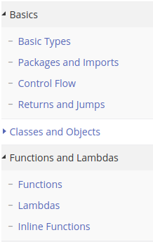

# Tarea 2

## Martes 23 de octubre

## Tarea (investigación)

1. **IMPORTANTE. LEER LA PRESENTACIÓN CORRESPONDIENTE AL TEMA DE** [**GUI's**](https://github.com/Androidkcourse/androidk37/blob/master/src/6_GUI/gui.md)
2. ¿Qué es MVC y MVP?
3. ¿Qué es 
4. Breve historia de Kotlin
5. ¿Quién creo Kotlin?
6. Características principales de Kotlin 
7. ¿Qué tipo de tipado tiene Kotlin?
8. ¿Qué es mejor Kotlin o Java? ¿Por qué?
9. ¿En qué lenguajes esta inspirado Kotlin?
10. ¿Desde cuando, Kotlin es el oficialmente un lenguaje soportado para el desarrollo de aplicaciones en Android?
11. ¿Qué es compilar?
12. ¿Qué es un archivo jar?
13. ¿Cuál es la diferencia entre `val` y `var`
14. ¿Cuáles son las funciones del operador `->`?
15. ¿Qué es y como se declara un función lambda en Java? y ¿A partir de que versión están disponibles?
16. ¿Qué es una activity?
17. ¿Cuál es el ciclo de vida de una actividad?
18. ¿Qué clase controla las actividades?
19. ¿Cómo creo una nueva actividad en android?
20. ¿Qué y para qué sirven los intent?
21. ¿Cuántos tipo de intent existen, describe ampliamente cada uno de ellos?
22. ¿Qué son las android native action?
23. ¿Qué es un bundle?
24. ¿Qué tipo de información puede ser enviada a través de un bundle?
25. ¿Cómo se usan los bundle en android?
26. Describe los principales métodos para enviar información entre actividades
27. ¿Qué es una alerta en android?
28. ¿Qué es un cuadro de diálogo en android?
29. ¿Qué es un dialogfragment?

### Extras

1. ¿Cuáles son las fases de compilación?
2. ¿Qué es un patrón de diseño?
3. ¿Qué es un idiom?
4. ¿Qué es Marp?
5. ¿Qué es electronjs?
6. ¿Qué es oh-my-zsh?
7. Installar oh-my-zsh
8. **¿Qué es doxygen?**
9. ¿Qué es y para que sirve Scala, Groovy?
10. **¿Quién es Mateo Salvatto y por qué es famoso?**

## Tarea (código)

* Hacer un el diseño de la aplicación de **SPOTIFY**.

  

Debe subir la aplicación a la siguiente liga. https://classroom.github.com/a/xIUHgrbN

Así mismo deben poner capturas de pantalla en el README (*es decir en la parte de abajo de este archivo*)